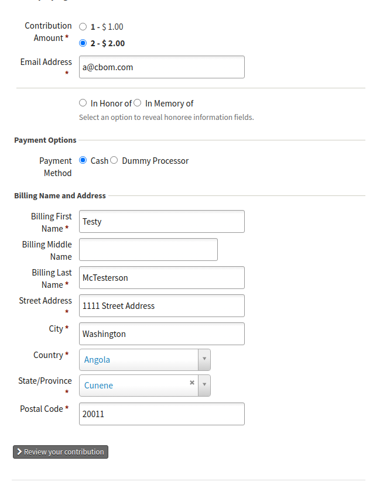
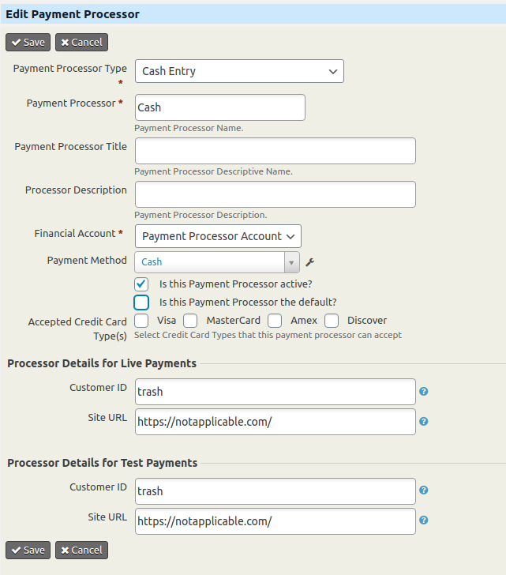

# com.aghstrategies.cashentry

Creates a Payment Processor Type "Cash Entry" and a Permission 'use Cash Entry Processors'.

IF the user has the permission 'use Cash Entry Processors' when they are on a Contribution or Event Registration Form that uses a Payment Processor of the type "Cash Entry" (amoung other processor options) they can see the Cash Entry option and select that option. Doing so will result in the creation of a contribution with the status "Completed".

IF the user DOES NOt have the permission 'use Cash Entry Processors' they will not be able to see the "Cash Entry" processor option.

IF the only processor type available on the form is a Cash Entry Processor and the logged in user does not have the permission 'use Cash Entry Processors' they will not be able to access the form.

## Configuration
1. Assign the permission 'use Cash Entry Processors' to the relevant roles.
2. Create a Payment Processor of the type "Cash Entry" be sure that:
- It is not the default
- The Payment Method is set to "Cash"

NOTE: the "Customer ID" and "Site URL" fields do not matter at all.

